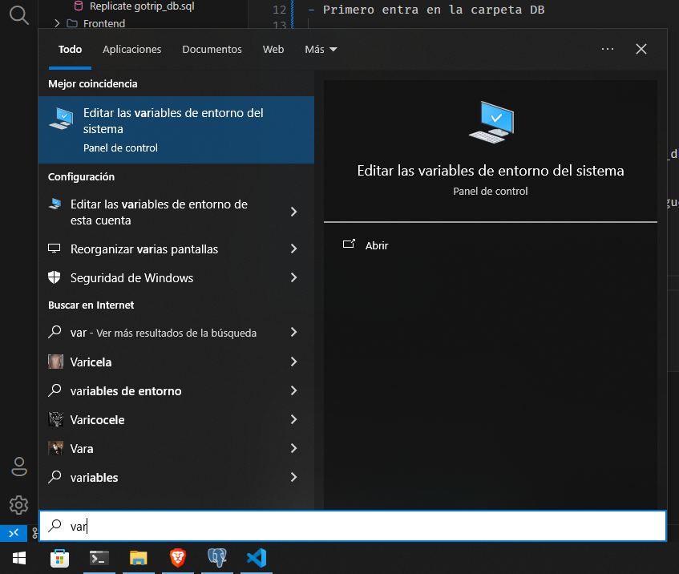
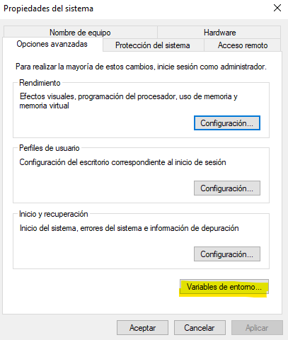
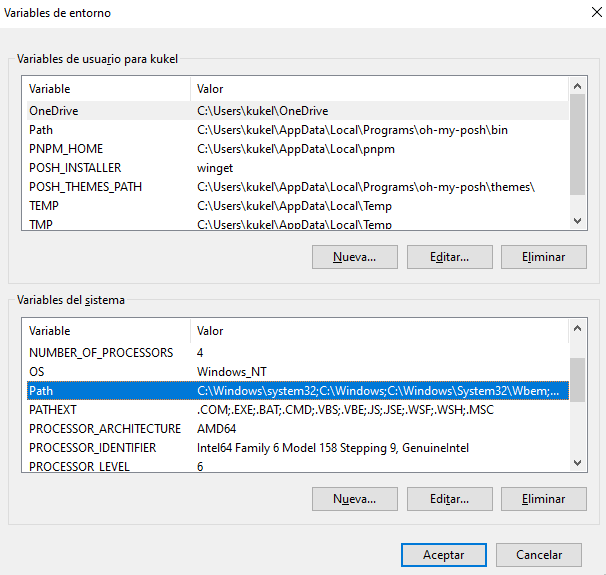
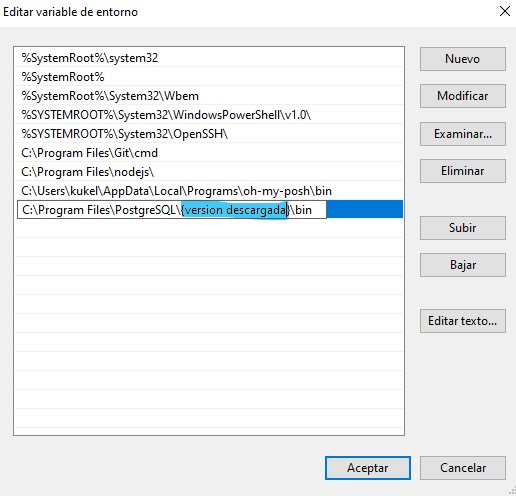

# Go Trip

## Índice

1. <a href="#1">Database</a>
2. <a href="#2">Back & Front</a>

    2.1 <a href="#2.1">Instalar dependencias</a>

    2.2 <a href="#2.2">Ejecutar Back y Front a la vez</a>

- <a href="#3">Extensión de comentarios (Better Comments)</a>

## Database

### Replicar base de datos

Para poder replicar la base de datos, deberás tener instalado <a target="_blank" href="https://sbp.enterprisedb.com/getfile.jsp?fileid=1259363">PostgreSQL</a>. Luego:

- Entra en la carpeta DB

    ```sh
    cd .\DB\
    ```

- Ejecuta el siguiente comando:

    ```sh
    psql -U postgres gotrip_db < Replicate_gotrip_db.pgsql
    ```

    - Si arroja que el comando `psql` no existe, sigue estos pasos:
    
    1. Busca "Variables de entorno"
    
        </img>
    
    2. Ve a "Variables de entorno"

        </img>

    3. Modifica "Path" en "Variables del sistema"

        </img>

    4. Agrega una nueva ruta

        </img>

    Ahora debería funcionar el comando.

La base de datos se ejecuta en `localhost:5432` o `127.0.0.1:5432`.

## Back & Front

### Instalar dependencias:

#### Backend
```sh
cd Backend && pnpm i
```

#### Frontend
```sh
cd .. && cd Frontend && pnpm i
```

### Ejecutar Back y Front a la vez

Ejecutar el siguiente comando en "Backend":
```sh
npm run dev
```
Esperamos recibir:
- `http://localhost:5173` (Front)
- `http://localhost:1234` (Back)

```sh
[1]   VITE v6.1.0  ready in 1090 ms
[1]
[1]   ➜  Local:   http://localhost:5173/
[1]   ➜  Network: use --host to expose
[0] [nodemon] 3.1.9
[0] [nodemon] to restart at any time, enter `rs`
[0] [nodemon] watching path(s): *.*
[0] [nodemon] watching extensions: js,mjs,cjs,json
[0] [nodemon] starting `node index.js`
[0] Server is running in http://localhost:1234
```

<h3 id="3">Extensión de comentarios (Better Comments)</h3>

Los comentarios están escritos para ser vistos con la extensión <a target="_blank" href="https://marketplace.visualstudio.com/items?itemName=aaron-bond.better-comments">Better Comments</a>.

</img>
